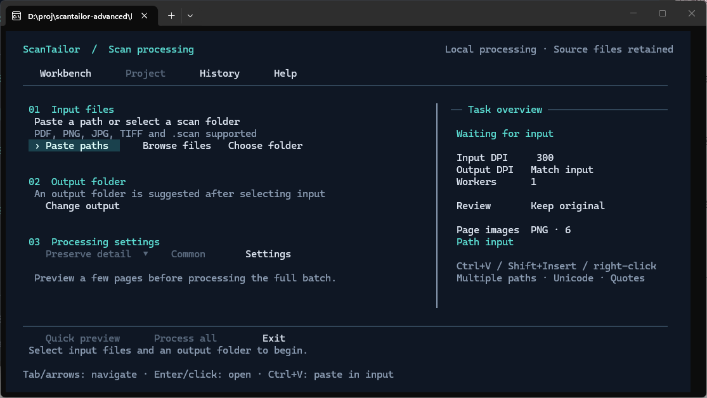
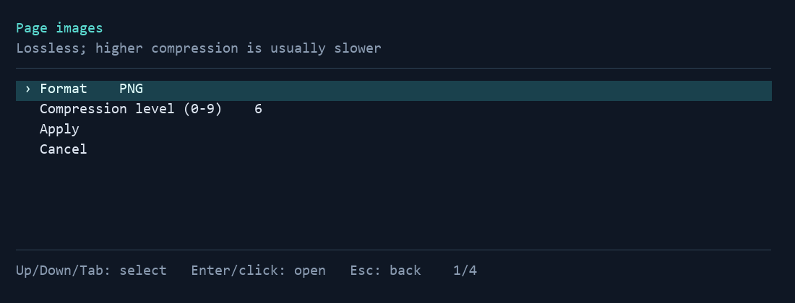
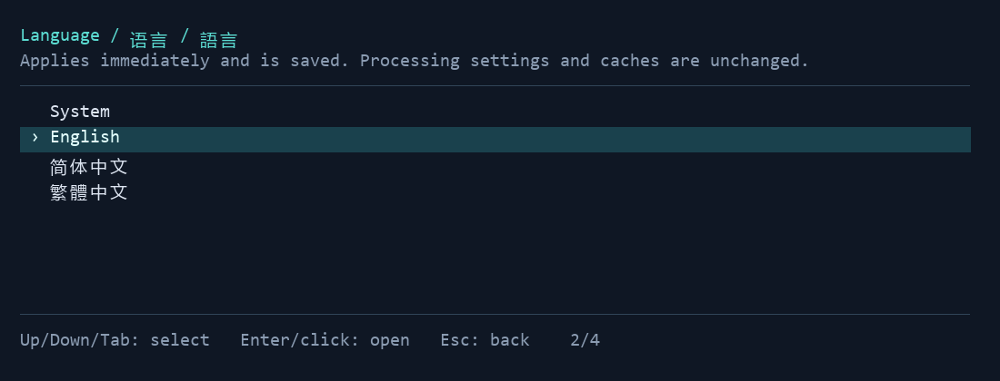

<p align="center">
  
</p>

<h1 align="center">ScanTailor CLI</h1>
<p align="center"><strong>Batch-clean scanned pages and PDFs with the ScanTailor Advanced engine.</strong></p>
<p align="center">Headless commands · Guided terminal workbench · Local processing</p>
<p align="center"><strong>English</strong> · <a href="README.zh-CN.md">简体中文</a> · <a href="README.zh-TW.md">繁體中文</a></p>

ScanTailor CLI adds scriptable document processing to **ScanTailor Advanced**. Deskew scans, split facing pages, adjust page boundaries and margins, and produce consistent image or PDF output. Use commands for repeatable batches, or the multilingual terminal workbench for guided setup and preview. The desktop GUI remains available for manual corrections.

The processing engine runs locally, without a cloud service or API key. OCR is outside its scope.

<p align="center">
  <a href="#quick-start">Quick start</a> ·
  <a href="#pdf-batches">PDF batches</a> ·
  <a href="#image-format-and-compression">Image encoding</a> ·
  <a href="#terminal-workbench">Workbench guide</a> ·
  <a href="#documentation">Documentation</a>
</p>



*Actual English CLI window screenshot, captured on Windows with ScanTailor CLI 3.4.0. [Screenshot provenance](docs/images/README.md).*

## What it does

| Capability | Practical use |
| --- | --- |
| **Image and project batches** | Process PNG, TIFF, JPEG and BMP inputs, multi-page TIFFs, or existing `.scan` projects. |
| **PDF folder processing** | Render scanned PDFs, run the native engine, and assemble `<name>.deskew.pdf` files. |
| **Six processing stages** | Orientation → page splitting → deskew → content selection → page layout → output. |
| **Configurable output** | Preserve color/grayscale, use black-and-white or mixed output, and configure PNG/TIFF/JPEG encoding. |
| **Preview and manual review** | Preview only first/middle/last source pages, reuse verified analysis, and refine geometry in the GUI. |
| **Automation and recovery** | UTF-8 JSONL events, per-page reports, exit codes, bounded concurrency, cancellation and hash-checked resume. |

The default `physics-safe` preset preserves color and grayscale and disables binarization, despeckling and automatic dewarping. It is a conservative starting point for textbooks, diagrams and fine lines; inspect the results before processing a large collection.

## Quick start

### 1. Prepare a Windows CLI bundle

Extract the **entire** CLI portable bundle to a writable folder. Keep `scantailor-cli.exe`, its DLLs, scripts and bundled Python together. A GUI-only ScanTailor installation does not include this CLI.

The examples below use **PowerShell 7**, opened in the extracted bundle directory. If you are working from source, use the [build instructions](#build-from-source) instead. If you do not have a CLI bundle, build one from this repository; no GitHub release assets are currently published for this fork.

```powershell
.\scantailor-cli.exe doctor
.\scantailor-cli.exe --help
```

`doctor` checks the native runtime. The PDF wrapper and workbench also need Python: a full portable bundle includes it; source users install the exact dependencies in [requirements-pdf.txt](scripts/requirements-pdf.txt).

### 2. Process an image folder

```powershell
.\scantailor-cli.exe process `
  --input 'D:\Scans\pages' `
  --output 'D:\Scans\clean' `
  --preset physics-safe --dpi 300 `
  --image-format png --png-compression 6 --jobs 2
```

Use a dedicated, initially empty output folder. Input images are naturally sorted; this command does not recurse into subfolders. `--dpi` sets the input DPI explicitly; `--output-dpi` sets the output resolution separately. Inputs remain unchanged.

Results include page images, `project.scan`, `report.json` and recovery state. Inspect the report as well as the images.

### 3. Preview before a full run

```powershell
.\scantailor-cli.exe preview `
  --input 'D:\Scans\pages' `
  --output 'D:\Scans\sample-preview' `
  --dpi 300 --source-pages sample --stage output --html
```

Open the HTML comparison reported by the command. `--source-pages sample` processes only the first, middle and last source pages, before splitting. Use `--source-pages 1,5,9` for explicit source pages. This quick preview does not calculate whole-book layout. For exact shared layout or page-specific rules, replace it with `--pages sample`; that mode analyzes the full project and exports sample logical pages. A preview is not a complete output batch or final PDF.

## PDF batches

From the portable bundle directory:

```powershell
.\Process-PdfFolder.ps1 `
  -PdfDir 'D:\Scans\pdf' `
  -ScanTailorDir $PWD.Path `
  -OutputDir 'D:\Scans\clean-pdf' `
  -Dpi 300 -Jobs 2 `
  -ImageFormat png -PngCompression 6
```

By default, the script processes PDFs directly inside the input folder, one book at a time. Add `-Recursive` to include subfolders. If `-OutputDir` is omitted, results go into `scantailor-output` under the input folder. Original PDFs are never overwritten.

| Result | Purpose |
| --- | --- |
| `<name>.deskew.pdf` | Assembled processed document. |
| `_scantailor/batch-report.json` | Per-document outcome and diagnostic references. |
| `_scantailor/.work/…/processed/report.json` | Per-page status, output hashes and available processing metrics. |
| `_scantailor/.work/…/processed/project.scan` | Project for manual editing in the desktop GUI. |
| `_scantailor/.work/…/review/index.html` | Before/after review of flagged pages. |

New PDF jobs place final PDFs directly in the output root and all auxiliary files under `_scantailor/`. Recursive or explicitly selected inputs receive a stable filename suffix to avoid collisions. Existing legacy output folders remain readable and resume in their original layout. Native image commands retain their documented flat output layout; workbench image results are managed under `_scantailor/operations/`.

**PDF behavior:** pages are rasterized at 300 DPI by default. Normal processed pages become image pages; original searchable text layers, links and forms are not retained. This workflow is intended for scanned documents. It does not losslessly extract embedded scan images or perform OCR.

`-PageSize original` is the default: output is fitted proportionally to the source page's visible physical size, with white padding when necessary. Use `-PageSize processed` for processed dimensions. Splitting can change the page count; if a split source page needs review, the wrapper preserves that original PDF page once. See the [PDF contract](docs/CLI.md) for details.

## Image format and compression

**PNG is the default, with lossless compression level 6.** These settings control PDF-rendered input images and CLI-produced page images. Existing source images are not rewritten.

| Format | Native CLI | PDF PowerShell wrapper | Default / trade-off |
| --- | --- | --- | --- |
| PNG | `--image-format png --png-compression 6` | `-ImageFormat png -PngCompression 6` | Level **6**, range **0–9**. Lossless; higher compression trades time for size. |
| TIFF | `--image-format tiff --tiff-compression deflate` | `-ImageFormat tiff -TiffCompression deflate` | **deflate**; also `none` and `lzw`. Lossless. |
| JPEG | `--image-format jpeg --jpeg-quality 95` | `-ImageFormat jpeg -JpegQuality 95` | Quality **95**, range **1–100**. Lossy; unsuitable for transparent layered output. |

PNG compression changes file size and encoding time, not pixel quality. JPEG in the PDF workflow may be encoded during both rendering and output. Only pass the compression option for the selected format. HTML previews remain PNG; GUI output and internal mask caches retain their TIFF behavior. Review fallbacks may preserve the original instead of using the requested encoding.

For reusable configuration:

```json
{
  "schema_version": 2,
  "image_encoding": { "format": "png", "png_compression": 6 }
}
```

Save this as `encoding.json` and pass `--config .\encoding.json`, or `-Config .\encoding.json` to the PDF script. Explicit command-line options override JSON configuration. Existing `.scan` settings are preserved unless explicitly overridden.

## Terminal workbench

```powershell
.\scantailor-cli.exe menu
```

The workbench supports **English, 简体中文 and 繁體中文**. It follows Windows preferred display languages by default; unsupported languages fall back to English. Automation commands retain English option names and stable JSON fields. Double-clicking `scantailor-cli.exe` also opens the workbench in an interactive console.

1. **Input files:** paste a file/folder path, browse files, or select a folder. Quoted paths, spaces and Chinese names are supported. In the multi-line path field, Enter inserts a newline; **Ctrl+Enter** confirms.
2. **Output folder:** choose a dedicated result folder.
3. **Processing settings:** select a conservative preset or edit common/advanced settings. Changes take effect only after applying the draft.
4. **Quick preview:** inspect the local comparison before choosing **Process all** for the complete batch.

The overview separates PDF render/input DPI from output DPI. Applied settings, including DPI, concurrency and image encoding, are saved automatically to `%LOCALAPPDATA%/ScanTailorCLI/menu/settings.json` and restored on the next launch. Page-specific rules and manual geometry remain in task snapshots, so they are not accidentally applied to another document. Completed tasks automatically move to the result menu and stop accruing elapsed time. Use **History** to inspect or resume an existing task. Before execution, the workbench explains the selected source count, stage and changed settings. It offers existing valid results for duplicates, asks whether to continue interrupted tasks, and requires confirmation before overwriting. Resume uses the original task settings and operation; it does not adopt current form edits or turn a preview into a full batch.



*Image encoding panel, rendered from the production dialog layout.* Open **Common → Image format and compression**. Select the format and compression, choose **Apply**, then **Apply settings** in the outer form. Cancelling either draft leaves the task settings unchanged. See the [workbench guide](docs/MENU.md) for all controls.

### Interface language

Open **Settings → Language / 语言 / 語言** and select **System**, **English**, **简体中文** or **繁體中文**. The choice takes effect immediately and is saved in the existing user settings file. Processing presets, task identity and cached results remain unchanged. You can reach Settings before selecting an input file.



For a one-launch override (does not replace your saved choice):

```powershell
.\scantailor-cli.exe menu --language en
.\scantailor-cli.exe menu --language zh-Hans
.\scantailor-cli.exe menu --language zh-Hant
.\scantailor-cli.exe menu --language auto
```

Script tags take precedence over region: `zh-Hans` uses Simplified Chinese; `zh-Hant`, Taiwan, Hong Kong and Macao use Traditional Chinese; mainland China and Singapore use Simplified Chinese. Other supported preferred languages are considered in Windows order before falling back to English. Raw native diagnostics and machine-readable values remain available unchanged. The local HTML comparison has its own three-language selector and does not reprocess pages when changed.

See the [Simplified Chinese guide and images](README.zh-CN.md) or [Traditional Chinese guide and images](README.zh-TW.md).

## Review, resume and automation

Resume the same task with the same paths and effective settings:

```powershell
.\scantailor-cli.exe process `
  --input 'D:\Scans\pages' --output 'D:\Scans\clean' `
  --preset physics-safe --dpi 300 --jobs 2 `
  --image-format png --png-compression 6 --resume

.\Process-PdfFolder.ps1 `
  -PdfDir 'D:\Scans\pdf' -ScanTailorDir $PWD.Path `
  -OutputDir 'D:\Scans\clean-pdf' -Dpi 300 -Jobs 2 `
  -ImageFormat png -PngCompression 6 -Resume
```

Resume validates inputs, effective configuration, the executable and output hashes before reusing results. Changed settings can require recomputation. PDF rendering is shared across previews and full processing; unchanged deskew/content/layout checkpoints can be reused when only output settings change. Native callers can share these checkpoints with `--analysis-cache <directory>`. Cache hits are hash-checked and reported as JSONL events; incomplete or invalid artifacts are rebuilt. Keep the `_scantailor` directory for recovery and review; intermediates are not automatically deleted and can use substantial disk space.

Low-confidence deskew, excessive angles or suspicious page boundaries can flag a page for review. The default PDF policy preserves its original page. A successful automatic check does not guarantee that all formulas, thin lines or edge content survived unchanged.

| Exit code | Meaning |
| --- | --- |
| `0` | Complete, no automatic review flags. |
| `1` | Review required or partial failure — read the report. |
| `2` | Invalid command or configuration. |
| `3` | Runtime, input/output or environment error. |
| `130` | Cancelled. |

Native commands emit UTF-8 JSONL on stdout and diagnostics on stderr. Use `config schema` to discover settings and `--help` for command syntax. Start with 1–2 workers for large pages; `--jobs` accepts 1–16. Ctrl+C requests cancellation; allow the current native task to finish and save a checkpoint.

For precise manual correction, open the generated `.scan` project in `scantailor-advanced.exe`, save your edits, then process it with `--project`. Do not edit the same output project in the GUI while the CLI is processing it.

```powershell
.\scantailor-cli.exe process `
  --project 'D:\Scans\corrected.scan' --output 'D:\Scans\corrected-output'
```

## Build from source

The maintained Windows entry point builds both CLI and GUI without downloading dependencies. The verified toolchain uses **Qt 6.8.3 / MinGW 13.1**, **Boost 1.85.0**, and the C image libraries, CMake and Ninja under a Strawberry C directory. Qt and the C++ compiler must use compatible runtimes.

Get the source, then adjust the dependency paths in the build command:

```powershell
git clone https://github.com/medicagooo/scantailor-advanced.git
Set-Location scantailor-advanced
```

```powershell
.\scripts\Build-Windows.ps1 `
  -QtRoot 'D:\Deps\Qt\6.8.3\mingw_64' `
  -CompilerRoot 'D:\Deps\Qt\Tools\mingw1310_64' `
  -BoostRoot 'D:\Deps\boost_1_85_0' `
  -NativeRoot 'C:\Strawberry\c' -BuildDir '.\build-native'

.\build-native\scantailor-cli.exe doctor
```

For Python features, prepare an environment with [the pinned dependencies](scripts/requirements-pdf.txt):

```powershell
python -m venv .venv
.\.venv\Scripts\python.exe -m pip install -r .\scripts\requirements-pdf.txt
```

Dependency installation needs package access or a prepared local wheel directory; normal processing runs offline. From source, invoke `scripts\Process-PdfFolder.ps1` with `-ScanTailorDir .\build-native` and, if needed, `-PythonExe <path-to-python.exe>`. The workbench accepts `menu --python <path-to-python.exe>`.

[Package-Windows.ps1](scripts/Package-Windows.ps1) creates a portable directory from the build and supplied dependencies; it can include embedded Python. The Windows scripts and bundle are the documented CLI path. Historical upstream platform/build notes are retained separately, not a claim that this fork's CLI is packaged for those platforms.

## Documentation

| Guide | Contents |
| --- | --- |
| [CLI and PDF reference](docs/CLI.md) — Chinese | Commands, schema, geometry, encoding, compatibility and PDF rules. |
| [Terminal workbench](docs/MENU.md) — Chinese | Input, presets, previews, project editing and task history. |
| [CLI coverage](docs/CLI-COVERAGE.md) | Mapping between GUI capabilities and CLI entry points. |
| [Verification record](docs/VERIFICATION.md) | Tested behavior and known limitations. |
| [Upstream reference](docs/UPSTREAM-README.md) | Preserved upstream feature history and build notes. |
| [Third-party components](docs/THIRD-PARTY.md) | Runtime dependencies and redistribution notes. |

## Contributing and license

When reporting an issue, include the CLI version, command/configuration, exit code and relevant report entries. Remove personal paths or document contents before sharing logs. For changes, explain the affected workflow and run the relevant [integration checks](docs/VERIFICATION.md) or [upstream unit tests](TESTING.md).

Built on ScanTailor Advanced and the work of ScanTailor, ScanTailor Featured, ScanTailor Enhanced and their contributors. Distributed under [GNU GPLv3](LICENSE); dependency licenses are listed in the [third-party notes](docs/THIRD-PARTY.md).
