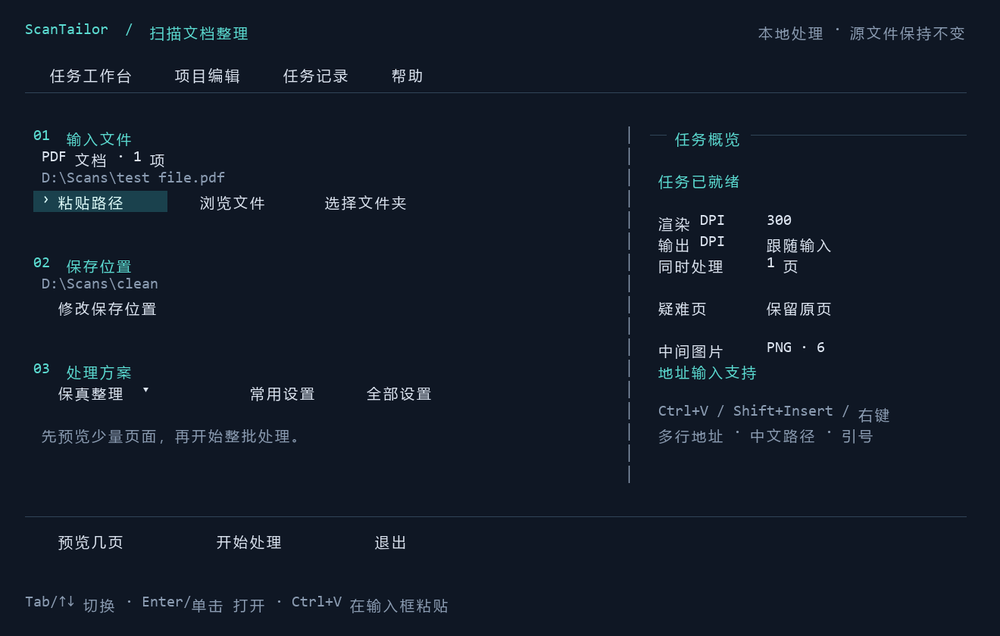
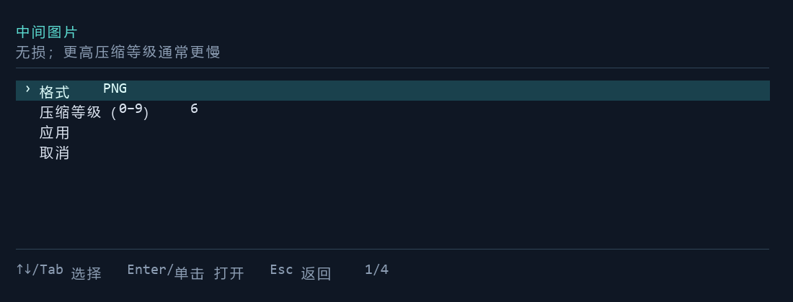

<p align="center">
  
</p>

<h1 align="center">ScanTailor CLI</h1>
<p align="center"><strong>用 ScanTailor Advanced 引擎，批量整理扫描图片和 PDF。</strong></p>
<p align="center">无界面命令行 · 中文终端工作台 · 本地处理</p>
<p align="center"><a href="README.md">English</a> · <strong>简体中文</strong></p>

ScanTailor CLI 为 **ScanTailor Advanced** 增加可脚本化的文档处理能力：批量纠偏、拆分左右页、调整纸张边界和页边距，输出整理后的图片或 PDF。需要自动化时直接调用命令；希望逐步设置时使用中文终端工作台。桌面 GUI 保留，用于精细调整和人工复核。

图像处理在本地执行，无需云端服务或 API Key；项目不包含 OCR。

<p align="center">
  <a href="#快速开始">快速开始</a> ·
  <a href="#pdf-批处理">PDF 批处理</a> ·
  <a href="#图片格式与压缩">图片格式与压缩</a> ·
  <a href="#中文终端工作台">工作台图解</a> ·
  <a href="#文档导航">文档导航</a>
</p>



*中文工作台界面图，由 CLI 的实际布局代码渲染；路径为演示值，不是桌面实机截图。[图片来源与生成方法](docs/images/README.md)。*

## 核心能力

| 能力 | 用途 |
| --- | --- |
| **图片与项目批处理** | 处理 PNG、TIFF、JPEG、BMP、多页 TIFF 或已有 `.scan` 项目。 |
| **PDF 文件夹处理** | 渲染扫描 PDF，调用原生引擎，组装 `<文件名>.deskew.pdf`。 |
| **完整六阶段流程** | 方向 → 页面拆分 → 纠偏 → 内容选择 → 页面布局 → 输出。 |
| **输出可配置** | 保留颜色和灰度，或生成黑白、混合输出；支持 PNG/TIFF/JPEG 及压缩设置。 |
| **预览与人工复核** | 抽取首、中、尾逻辑页，本地对照原图与结果，必要时用 GUI 修正几何参数。 |
| **自动化与恢复** | UTF-8 JSONL 事件、逐页报告、退出码、并发控制、取消和哈希校验恢复。 |

默认 `physics-safe` 预设保留颜色和灰度，关闭二值化、去斑点和自动曲面展平。适合教材、图表、细线等内容的保守整理；正式批处理前仍应检查样页。

## 快速开始

### 1. 准备 Windows CLI 便携包

将 CLI 便携包**完整解压**到可写目录。保留 `scantailor-cli.exe`、DLL、脚本及内置 Python 的目录关系。只有 GUI 的旧版 ScanTailor 安装包不能运行这里的 CLI 流程。

以下命令使用 **PowerShell 7**，在解压后的便携包目录执行。源码用户请先按[源码构建](#源码构建)准备程序。如果没有 CLI 便携包，可以从本仓库构建；当前此 fork 尚未发布 GitHub Release 资产。

```powershell
.\scantailor-cli.exe doctor
.\scantailor-cli.exe --help
```

`doctor` 检查原生运行环境。PDF 包装脚本和终端工作台还需要 Python：完整便携包自带；源码运行时需在自己的环境安装 [requirements-pdf.txt](scripts/requirements-pdf.txt) 中固定版本的依赖。

### 2. 处理图片文件夹

```powershell
.\scantailor-cli.exe process `
  --input 'D:\Scans\pages' `
  --output 'D:\Scans\clean' `
  --preset physics-safe --dpi 300 `
  --image-format png --png-compression 6 --jobs 2
```

使用专用且初始为空的输出目录。输入图片按自然顺序排序，此命令不递归子目录。`--dpi` 显式指定输入 DPI；如需单独设置输出分辨率，使用 `--output-dpi`。原始图片保持不变。

输出包含逐页图片、`project.scan`、`report.json` 和恢复状态。检查图片的同时，也要查看报告。

### 3. 先做抽样预览

```powershell
.\scantailor-cli.exe preview `
  --input 'D:\Scans\pages' `
  --output 'D:\Scans\sample-preview' `
  --dpi 300 --source-pages sample --stage output --html
```

打开命令报告中的 HTML 对照页。`--source-pages sample` 在任何处理前选择首、中、尾源页，只处理这些源页；也可使用 `--source-pages 1,5,9`。快速预览不计算整书统一布局。需要精确共享布局或按页规则时，改用 `--pages sample`：该模式分析完整项目，仅导出抽样逻辑页。预览不等于整批输出，也不会生成最终完整 PDF。

## PDF 批处理

在便携包目录执行：

```powershell
.\Process-PdfFolder.ps1 `
  -PdfDir 'D:\Scans\pdf' `
  -ScanTailorDir $PWD.Path `
  -OutputDir 'D:\Scans\clean-pdf' `
  -Dpi 300 -Jobs 2 `
  -ImageFormat png -PngCompression 6
```

默认逐本处理输入目录直属的 PDF；增加 `-Recursive` 可包含子目录。省略 `-OutputDir` 时，结果位于输入目录下的 `scantailor-output`。原始 PDF 不覆盖。

| 输出 | 说明 |
| --- | --- |
| `<文件名>.deskew.pdf` | 组装完成的处理结果。 |
| `_scantailor/batch-report.json` | 每本文档的状态与诊断入口。 |
| `_scantailor/.work/…/processed/report.json` | 每页状态、输出哈希及可用的算法指标。 |
| `_scantailor/.work/…/processed/project.scan` | 可用桌面 GUI 手动编辑的项目。 |
| `_scantailor/.work/…/review/index.html` | 被标记页面的处理前后对照。 |

新 PDF 任务的最终 PDF 直接放在输出目录根部，其余文件统一放入 `_scantailor/`。递归或显式选择输入时，文件名附稳定后缀以避免冲突。旧输出目录继续按原布局读取与恢复。原生图片命令保留平铺输出接口；工作台图片任务放入 `_scantailor/operations/`。

**PDF 处理方式：** 默认按 300 DPI 将页面渲染为图片。正常处理页会成为图像页，不保留原有的可搜索文字层、链接和表单。本流程面向扫描文档，不是 PDF 内嵌图像的无损提取工具，也不执行 OCR。

默认 `-PageSize original` 按原 PDF 可见页面的物理尺寸等比例适配结果，必要时加白边；`-PageSize processed` 使用处理后的尺寸。拆页可能改变页数；如果拆分源页需要复核，包装层会将原 PDF 页保留一次。具体规则见 [PDF 与 CLI 完整参考](docs/CLI.md)。

## 图片格式与压缩

**默认 PNG，无损压缩等级 6。** 这些设置影响 PDF 渲染得到的输入图片及 CLI 输出的页面图片，不会重写已有源图片。

| 格式 | 原生 CLI 参数 | PDF PowerShell 参数 | 默认值与取舍 |
| --- | --- | --- | --- |
| PNG | `--image-format png --png-compression 6` | `-ImageFormat png -PngCompression 6` | 默认 **6**，范围 **0–9**；无损，较高等级通常需要更多压缩时间。 |
| TIFF | `--image-format tiff --tiff-compression deflate` | `-ImageFormat tiff -TiffCompression deflate` | 默认 **deflate**，也支持 `none`、`lzw`；无损。 |
| JPEG | `--image-format jpeg --jpeg-quality 95` | `-ImageFormat jpeg -JpegQuality 95` | 默认 **95**，范围 **1–100**；有损，不适合透明分层输出。 |

PNG 压缩等级影响文件体积和编码时间，不影响像素质量。PDF 使用 JPEG 时，渲染与处理输出可能各编码一次。只传入当前格式对应的压缩参数。HTML 预览仍使用 PNG；GUI 输出和内部蒙版缓存保留 TIFF 行为。疑难页回退可能保留原始内容，而不采用指定编码。

也可保存为配置文件：

```json
{
  "schema_version": 2,
  "image_encoding": { "format": "png", "png_compression": 6 }
}
```

保存为 `encoding.json`，原生 CLI 使用 `--config .\encoding.json`，PDF 脚本使用 `-Config .\encoding.json`。显式命令行参数优先于 JSON 配置；已有 `.scan` 处理设置在未显式覆盖时保留。

## 中文终端工作台

```powershell
.\scantailor-cli.exe menu
```

工作台当前使用**中文界面**，自动化命令使用英文参数名。交互式控制台中双击 `scantailor-cli.exe` 也可以进入工作台。

1. **输入文件：** 粘贴文件/文件夹地址，或浏览选择。支持引号、空格和中文路径。多行地址框中 Enter 换行，**Ctrl+Enter** 确认。
2. **保存位置：** 选择独立的结果目录。
3. **处理方案：** 选择保真方案，或调整常用/全部设置。编辑先保留在草稿中，应用后才生效。
4. **预览几页：** 查看本地对照效果，再选择**开始处理**执行完整批次。

首页将 PDF 渲染/图片输入 DPI 与输出 DPI 分开显示。应用后的 DPI、并发、图片编码等设置自动保存到 `%LOCALAPPDATA%/ScanTailorCLI/menu/settings.json`，下次启动自动加载。按页规则与手动几何留在任务快照中，不会套用到另一份文档。任务完成后自动进入结果菜单，计时停止；通过**任务记录**查看或恢复已有任务。执行前会说明本次源页数、目标阶段及设置差异；重复任务可打开已验证结果，中断任务会询问是否继续，覆盖需要确认。继续任务沿用当时的输入、设置和操作，不采用当前表单修改，也不会把预览变为完整处理。



*由程序实际对话框布局渲染的图片编码面板。* 从**处理方案 → 自定义常用设置 → 中间图片格式与压缩**进入。选好格式与压缩后先点**应用**，再在外层点击**应用设置**。任一级取消均不会改变任务设置。完整操作见[工作台使用说明](docs/MENU.md)。

## 复核、恢复与自动化

使用相同路径与有效配置恢复同一任务：

```powershell
.\scantailor-cli.exe process `
  --input 'D:\Scans\pages' --output 'D:\Scans\clean' `
  --preset physics-safe --dpi 300 --jobs 2 `
  --image-format png --png-compression 6 --resume

.\Process-PdfFolder.ps1 `
  -PdfDir 'D:\Scans\pdf' -ScanTailorDir $PWD.Path `
  -OutputDir 'D:\Scans\clean-pdf' -Dpi 300 -Jobs 2 `
  -ImageFormat png -PngCompression 6 -Resume
```

恢复前会检查输入、有效配置、程序文件和输出哈希。修改设置可能导致重新计算。PDF 渲染缓存由预览和完整处理共享；仅修改输出设置时，可复用有效的纠偏、内容和布局检查点。原生命令可用 `--analysis-cache <目录>` 共享阶段缓存。复用需通过哈希校验，命中情况写入 JSONL，缺失或无效结果会补算。保留 `_scantailor` 目录以便恢复和复核；中间文件不自动清理，可能占用较多磁盘空间。

纠偏置信度低、角度过大或纸张边界异常时，页面可能进入复核。默认 PDF 策略保留对应原页。通过自动检查并不能保证公式、细线或贴边内容完全无损。

| 退出码 | 含义 |
| --- | --- |
| `0` | 全部完成，无自动复核标记。 |
| `1` | 需要复核或部分失败，应读取报告。 |
| `2` | 命令或配置错误。 |
| `3` | 运行环境、输入输出等错误。 |
| `130` | 已取消。 |

原生命令通过 stdout 输出 UTF-8 JSONL，通过 stderr 输出诊断信息。`config schema` 可查询配置结构，`--help` 可查看命令语法。大尺寸页面建议从 1–2 个并发开始；`--jobs` 支持 1–16。Ctrl+C 请求取消后，等待当前原生任务退出并保存检查点。

需要精细修正时，用 `scantailor-advanced.exe` 打开生成的 `.scan` 项目，保存修改，再通过 `--project` 重新处理。不要在 CLI 处理期间同时用 GUI 编辑同一输出项目。

```powershell
.\scantailor-cli.exe process `
  --project 'D:\Scans\corrected.scan' --output 'D:\Scans\corrected-output'
```

## 源码构建

维护中的 Windows 构建入口同时生成 CLI 与 GUI，不自动下载依赖。已验证组合为 **Qt 6.8.3 / MinGW 13.1**、**Boost 1.85.0**，以及 Strawberry C 目录下的图像 C 库、CMake 和 Ninja。Qt 与 C++ 编译器必须使用兼容的运行库。

获取源码，再按本机环境替换构建命令中的依赖路径：

```powershell
git clone https://github.com/medicagooo/scantailor-advanced.git
Set-Location scantailor-advanced
```

```powershell
.\scripts\Build-Windows.ps1 `
  -QtRoot 'D:\Deps\Qt\6.8.3\mingw_64' `
  -CompilerRoot 'D:\Deps\Qt\Tools\mingw1310_64' `
  -BoostRoot 'D:\Deps\boost_1_85_0' `
  -NativeRoot 'C:\Strawberry\c' -BuildDir '.\build-native'

.\build-native\scantailor-cli.exe doctor
```

Python 功能使用独立环境及[固定版本依赖](scripts/requirements-pdf.txt)：

```powershell
python -m venv .venv
.\.venv\Scripts\python.exe -m pip install -r .\scripts\requirements-pdf.txt
```

安装依赖需要访问软件包源，或准备本地 wheel 目录；正常文档处理可离线运行。源码运行 PDF 时，调用 `scripts\Process-PdfFolder.ps1` 并设置 `-ScanTailorDir .\build-native`；需要时通过 `-PythonExe <Python程序路径>` 指定解释器。工作台支持 `menu --python <Python程序路径>`。

[Package-Windows.ps1](scripts/Package-Windows.ps1) 根据构建产物及已提供依赖创建便携目录，可加入嵌入式 Python。本文的 CLI 安装与使用以 Windows 脚本和便携包为准；上游其他平台的历史构建说明单独保留，不代表当前 fork 的 CLI 已有对应发行包。

## 文档导航

| 文档 | 内容 |
| --- | --- |
| [CLI 与 PDF 完整参考](docs/CLI.md) | 命令、配置结构、几何参数、编码、兼容性与 PDF 规则。 |
| [中文终端工作台](docs/MENU.md) | 输入、方案、预览、项目编辑和任务记录。 |
| [CLI 功能覆盖](docs/CLI-COVERAGE.md) | GUI 功能与 CLI 入口的对应关系。 |
| [验证记录](docs/VERIFICATION.md) | 已验证行为与已知限制。 |
| [上游参考文档](docs/UPSTREAM-README.md) | 保留的上游功能历史与构建说明。 |
| [第三方组件](docs/THIRD-PARTY.md) | 运行依赖与分发说明。 |

## 贡献与许可证

反馈问题时，请提供 CLI 版本、命令/配置、退出码及相关报告条目，分享前移除个人路径或文档内容。提交修改时说明影响的流程，并执行相关[集成检查](docs/VERIFICATION.md)或[上游单元测试](TESTING.md)。

项目基于 ScanTailor Advanced，感谢 ScanTailor、ScanTailor Featured、ScanTailor Enhanced 及相关贡献者。采用 [GNU GPLv3](LICENSE)；依赖许可证见[第三方组件说明](docs/THIRD-PARTY.md)。
