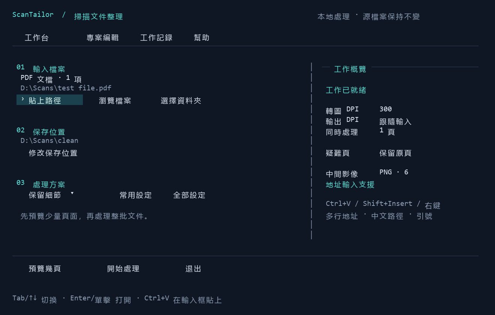
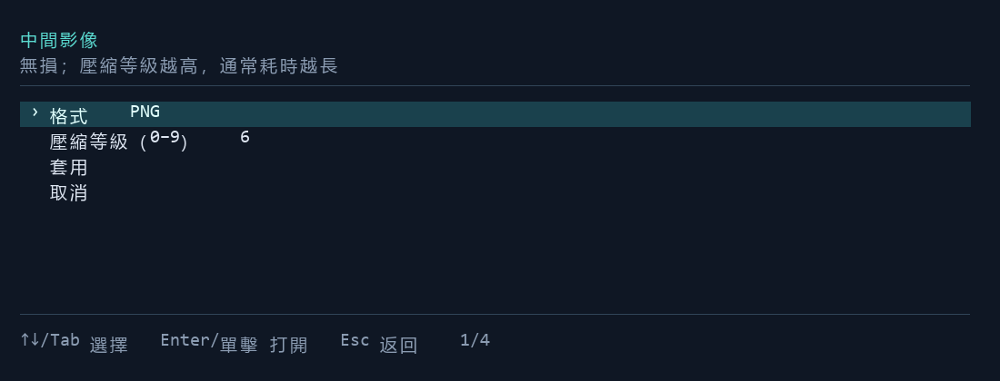
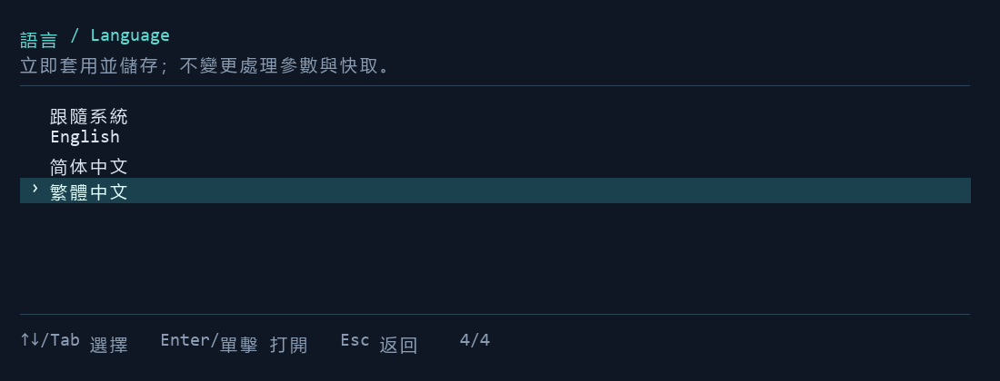

<p align="center">
  
</p>

<h1 align="center">ScanTailor CLI</h1>
<p align="center"><strong>用 ScanTailor Advanced 引擎，批次整理掃描影像和 PDF。</strong></p>
<p align="center">無介面命令行 · 多語言終端工作台 · 本地處理</p>
<p align="center"><a href="README.md">English</a> · <a href="README.zh-CN.md">简体中文</a> · <strong>繁體中文</strong></p>

ScanTailor CLI 為 **ScanTailor Advanced** 增加可腳本化的文件處理能力：批次糾偏、拆分左右頁、調整紙張邊界和頁邊距，輸出整理後的影像或 PDF。需要自動化時直接呼叫命令；希望逐步設定時使用多語言終端工作台。桌面 GUI 保留，用於精細調整和人工檢查。

影像處理在本地執行，無需雲端服務或 API Key；專案不包含 OCR。

<p align="center">
  <a href="#快速開始">快速開始</a> ·
  <a href="#pdf-批處理">PDF 批處理</a> ·
  <a href="#影像格式與壓縮">影像格式與壓縮</a> ·
  <a href="#多語言終端工作台">工作臺圖解</a> ·
  <a href="#文件導航">文件導航</a>
</p>



*中文工作臺介面圖，由 CLI 的實際版面配置程式碼繪製；路徑為演示值，不是桌面實機螢幕截圖。[影像來源與生成方法](docs/images/README.md)。*

## 核心能力

| 能力 | 用途 |
| --- | --- |
| **影像與專案批處理** | 處理 PNG、TIFF、JPEG、BMP、多頁 TIFF 或已有 `.scan` 專案。 |
| **PDF 資料夾處理** | 轉圖掃描 PDF，呼叫原生引擎，組裝 `<檔案名稱>.deskew.pdf`。 |
| **完整六階段流程** | 方向 → 頁面拆分 → 糾偏 → 內容選擇 → 頁面版面配置 → 輸出。 |
| **輸出可設定** | 保留顏色和灰度，或生成黑白、混合輸出；支援 PNG/TIFF/JPEG 及壓縮設定。 |
| **預覽與人工檢查** | 抽取首、中、尾邏輯頁，本地對照原圖與結果，必要時用 GUI 修正幾何參數。 |
| **自動化與恢復** | UTF-8 JSONL 事件、逐頁報告、退出碼、并發控制、取消和哈希校驗恢復。 |

預設 `physics-safe` 預設保留顏色和灰度，關閉二值化、去斑點和自動曲面展平。適合教材、圖表、細線等內容的保守整理；正式批處理前仍應檢查樣頁。

## 快速開始

### 1. 準備 Windows CLI 便攜包

將 CLI 便攜包**完整解壓**到可寫目錄。保留 `scantailor-cli.exe`、DLL、腳本及內置 Python 的目錄關系。只有 GUI 的舊版 ScanTailor 安裝包不能運行這里的 CLI 流程。

以下命令使用 **PowerShell 7**，在解壓後的便攜包目錄執行。源碼用戶請先按[源碼構建](#源碼構建)準備程序。如果沒有 CLI 便攜包，可以從本倉庫構建；當前此 fork 尚未發布 GitHub Release 資產。

```powershell
.\scantailor-cli.exe doctor
.\scantailor-cli.exe --help
```

`doctor` 檢查原生運行環境。PDF 包裝腳本和終端工作臺還需要 Python：完整便攜包自帶；源碼運行時需在自己的環境安裝 [requirements-pdf.txt](scripts/requirements-pdf.txt) 中固定版本的依賴。

### 2. 處理影像資料夾

```powershell
.\scantailor-cli.exe process `
  --input 'D:\Scans\pages' `
  --output 'D:\Scans\clean' `
  --preset physics-safe --dpi 300 `
  --image-format png --png-compression 6 --jobs 2
```

使用專用且初始為空的輸出目錄。輸入影像按自然順序排序，此命令不遞歸子目錄。`--dpi` 顯式指定輸入 DPI；如需單獨設定輸出分辨率，使用 `--output-dpi`。原始影像保持不變。

輸出包含逐頁影像、`project.scan`、`report.json` 和恢復狀態。檢查影像的同時，也要查看報告。

### 3. 先做抽樣預覽

```powershell
.\scantailor-cli.exe preview `
  --input 'D:\Scans\pages' `
  --output 'D:\Scans\sample-preview' `
  --dpi 300 --source-pages sample --stage output --html
```

打開命令報告中的 HTML 對照頁。`--source-pages sample` 在任何處理前選擇首、中、尾源頁，只處理這些源頁；也可使用 `--source-pages 1,5,9`。快速預覽不計算整書統一版面配置。需要精確共享版面配置或按頁規則時，改用 `--pages sample`：該模式分析完整專案，僅導出抽樣邏輯頁。預覽不等于整批輸出，也不會生成最終完整 PDF。

## PDF 批處理

在便攜包目錄執行：

```powershell
.\Process-PdfFolder.ps1 `
  -PdfDir 'D:\Scans\pdf' `
  -ScanTailorDir $PWD.Path `
  -OutputDir 'D:\Scans\clean-pdf' `
  -Dpi 300 -Jobs 2 `
  -ImageFormat png -PngCompression 6
```

預設逐本處理輸入目錄直屬的 PDF；增加 `-Recursive` 可包含子目錄。省略 `-OutputDir` 時，結果位于輸入目錄下的 `scantailor-output`。原始 PDF 不覆蓋。

| 輸出 | 說明 |
| --- | --- |
| `<檔案名稱>.deskew.pdf` | 組裝完成的處理結果。 |
| `_scantailor/batch-report.json` | 每本文件的狀態與診斷入口。 |
| `_scantailor/.work/…/processed/report.json` | 每頁狀態、輸出哈希及可用的算法指標。 |
| `_scantailor/.work/…/processed/project.scan` | 可用桌面 GUI 手動編輯的專案。 |
| `_scantailor/.work/…/review/index.html` | 被標記頁面的處理前后對照。 |

新 PDF 工作的最終 PDF 直接放在輸出目錄根部，其余檔案統一放入 `_scantailor/`。遞歸或顯式選擇輸入時，檔案名稱附穩定后綴以避免沖突。舊輸出目錄繼續按原版面配置讀取與恢復。原生影像命令保留平鋪輸出接口；工作臺影像工作放入 `_scantailor/operations/`。

**PDF 處理方式：** 預設按 300 DPI 將頁面轉圖為影像。正常處理頁會成為影像頁，不保留原有的可搜索文字層、鏈接和表單。本流程面向掃描文件，不是 PDF 內嵌影像的無損提取工具，也不執行 OCR。

預設 `-PageSize original` 按原 PDF 可見頁面的物理尺寸等比例適配結果，必要時加白邊；`-PageSize processed` 使用處理後的尺寸。拆頁可能改變頁數；如果拆分源頁需要檢查，包裝層會將原 PDF 頁保留一次。具體規則見 [PDF 與 CLI 完整參考](docs/CLI.md)。

## 影像格式與壓縮

**預設 PNG，無損壓縮等級 6。** 這些設定影響 PDF 轉圖得到的輸入影像及 CLI 輸出的頁面影像，不會重寫已有源影像。

| 格式 | 原生 CLI 參數 | PDF PowerShell 參數 | 預設值與取舍 |
| --- | --- | --- | --- |
| PNG | `--image-format png --png-compression 6` | `-ImageFormat png -PngCompression 6` | 預設 **6**，范圍 **0–9**；無損，較高等級通常需要更多壓縮時間。 |
| TIFF | `--image-format tiff --tiff-compression deflate` | `-ImageFormat tiff -TiffCompression deflate` | 預設 **deflate**，也支援 `none`、`lzw`；無損。 |
| JPEG | `--image-format jpeg --jpeg-quality 95` | `-ImageFormat jpeg -JpegQuality 95` | 預設 **95**，范圍 **1–100**；有損，不適合透明分層輸出。 |

PNG 壓縮等級影響檔案體積和編碼時間，不影響像素品質。PDF 使用 JPEG 時，轉圖與處理輸出可能各編碼一次。只傳入當前格式對應的壓縮參數。HTML 預覽仍使用 PNG；GUI 輸出和內部蒙版快取保留 TIFF 行為。疑難頁回退可能保留原始內容，而不采用指定編碼。

也可保存為設定檔案：

```json
{
  "schema_version": 2,
  "image_encoding": { "format": "png", "png_compression": 6 }
}
```

保存為 `encoding.json`，原生 CLI 使用 `--config .\encoding.json`，PDF 腳本使用 `-Config .\encoding.json`。顯式命令行參數優先于 JSON 設定；已有 `.scan` 處理設定在未顯式覆蓋時保留。

## 多語言終端工作台

```powershell
.\scantailor-cli.exe menu
```

工作臺支援 **English、簡體中文與繁體中文**，預設按 Windows 當前用戶首選顯示語言自動選擇；沒有匹配語言時使用英文。自動化命令的英文參數名和 JSON 字段保持穩定。交互式控制臺中雙擊 `scantailor-cli.exe` 也可以進入工作臺。

1. **輸入檔案：** 貼上檔案/資料夾地址，或瀏覽選擇。支援引號、空格和中文路徑。多行地址框中 Enter 換行，**Ctrl+Enter** 確認。
2. **保存位置：** 選擇獨立的結果目錄。
3. **處理方案：** 選擇保留細節方案，或調整常用/全部設定。編輯先保留在草稿中，應用后才生效。
4. **預覽幾頁：** 查看本地對照效果，再選擇**開始處理**執行完整批次。

首頁將 PDF 轉圖/影像輸入 DPI 與輸出 DPI 分開顯示。應用後的 DPI、并發、影像編碼等設定自動保存到 `%LOCALAPPDATA%/ScanTailorCLI/menu/settings.json`，下次啟動自動加載。按頁規則與手動幾何留在工作快照中，不會套用到另一份文件。工作完成後自動進入結果菜單，計時停止；通過**工作記錄**查看或恢復已有工作。執行前會說明本次源頁數、目標階段及設定差異；重復工作可打開已驗證結果，中斷工作會詢問是否繼續，覆蓋需要確認。繼續工作沿用當時的輸入、設定和操作，不采用當前表單修改，也不會把預覽變為完整處理。



*由程序實際對話框版面配置轉圖的影像編碼面板。* 從**處理方案 → 自定義常用設定 → 中間影像格式與壓縮**進入。選好格式與壓縮后先點**應用**，再在外層點擊**應用設定**。任一級取消均不會改變工作設定。完整操作見[工作臺使用說明](docs/MENU.md)。

### 介面語言

進入**全部設定 → 語言 / Language**，選擇**跟隨系統、English、簡體中文或繁體中文**。立即生效并自動保存；不會改變處理參數、工作身份、已有預覽或快取。尚未導入檔案時也能進入全部設定。



也可僅為本次啟動指定語言，不修改已保存的選擇：

```powershell
.\scantailor-cli.exe menu --language en
.\scantailor-cli.exe menu --language zh-Hans
.\scantailor-cli.exe menu --language zh-Hant
.\scantailor-cli.exe menu --language auto
```

識別時優先采用文字體系：`zh-Hans` 使用簡體；`zh-Hant` 及臺灣、香港、澳門使用繁體；中國大陸與新加坡使用簡體。按 Windows 首選語言順序匹配，均不支援時回退英文。底層原始診斷與機器可讀值保留原樣。HTML 對照頁也有三語言選擇器，切換不會重新處理頁面。

參閱 [English 使用說明與配圖](README.md)或[简体中文使用说明与配图](README.zh-CN.md)。

## 檢查、恢復與自動化

使用相同路徑與有效設定恢復同一工作：

```powershell
.\scantailor-cli.exe process `
  --input 'D:\Scans\pages' --output 'D:\Scans\clean' `
  --preset physics-safe --dpi 300 --jobs 2 `
  --image-format png --png-compression 6 --resume

.\Process-PdfFolder.ps1 `
  -PdfDir 'D:\Scans\pdf' -ScanTailorDir $PWD.Path `
  -OutputDir 'D:\Scans\clean-pdf' -Dpi 300 -Jobs 2 `
  -ImageFormat png -PngCompression 6 -Resume
```

恢復前會檢查輸入、有效設定、程序檔案和輸出哈希。修改設定可能導致重新計算。PDF 轉圖快取由預覽和完整處理共享；僅修改輸出設定時，可復用有效的糾偏、內容和版面配置檢查點。原生命令可用 `--analysis-cache <目錄>` 共享階段快取。復用需通過哈希校驗，命中情況寫入 JSONL，缺失或無效結果會補算。保留 `_scantailor` 目錄以便恢復和檢查；中間檔案不自動清理，可能占用較多磁盤空間。

糾偏置信度低、角度過大或紙張邊界異常時，頁面可能進入檢查。預設 PDF 策略保留對應原頁。通過自動檢查并不能保證公式、細線或貼邊內容完全無損。

| 退出碼 | 含義 |
| --- | --- |
| `0` | 全部完成，無自動檢查標記。 |
| `1` | 需要檢查或部分失敗，應讀取報告。 |
| `2` | 命令或設定錯誤。 |
| `3` | 運行環境、輸入輸出等錯誤。 |
| `130` | 已取消。 |

原生命令通過 stdout 輸出 UTF-8 JSONL，通過 stderr 輸出診斷信息。`config schema` 可查詢設定結構，`--help` 可查看命令語法。大尺寸頁面建議從 1–2 個并發開始；`--jobs` 支援 1–16。Ctrl+C 請求取消后，等待當前原生工作退出并保存檢查點。

需要精細修正時，用 `scantailor-advanced.exe` 打開生成的 `.scan` 專案，保存修改，再通過 `--project` 重新處理。不要在 CLI 處理期間同時用 GUI 編輯同一輸出專案。

```powershell
.\scantailor-cli.exe process `
  --project 'D:\Scans\corrected.scan' --output 'D:\Scans\corrected-output'
```

## 源碼構建

維護中的 Windows 構建入口同時生成 CLI 與 GUI，不自動下載依賴。已驗證組合為 **Qt 6.8.3 / MinGW 13.1**、**Boost 1.85.0**，以及 Strawberry C 目錄下的影像 C 庫、CMake 和 Ninja。Qt 與 C++ 編譯器必須使用兼容的運行庫。

獲取源碼，再按本機環境替換構建命令中的依賴路徑：

```powershell
git clone https://github.com/medicagooo/scantailor-advanced.git
Set-Location scantailor-advanced
```

```powershell
.\scripts\Build-Windows.ps1 `
  -QtRoot 'D:\Deps\Qt\6.8.3\mingw_64' `
  -CompilerRoot 'D:\Deps\Qt\Tools\mingw1310_64' `
  -BoostRoot 'D:\Deps\boost_1_85_0' `
  -NativeRoot 'C:\Strawberry\c' -BuildDir '.\build-native'

.\build-native\scantailor-cli.exe doctor
```

Python 功能使用獨立環境及[固定版本依賴](scripts/requirements-pdf.txt)：

```powershell
python -m venv .venv
.\.venv\Scripts\python.exe -m pip install -r .\scripts\requirements-pdf.txt
```

安裝依賴需要訪問軟件包源，或準備本地 wheel 目錄；正常文件處理可離線運行。源碼運行 PDF 時，呼叫 `scripts\Process-PdfFolder.ps1` 并設定 `-ScanTailorDir .\build-native`；需要時通過 `-PythonExe <Python程序路徑>` 指定解釋器。工作臺支援 `menu --python <Python程序路徑>`。

[Package-Windows.ps1](scripts/Package-Windows.ps1) 根據構建產物及已提供依賴創建便攜目錄，可加入嵌入式 Python。本文的 CLI 安裝與使用以 Windows 腳本和便攜包為準；上游其他平臺的歷史構建說明單獨保留，不代表當前 fork 的 CLI 已有對應發行包。

## 文件導航

| 文件 | 內容 |
| --- | --- |
| [CLI 與 PDF 完整參考](docs/CLI.md) | 命令、設定結構、幾何參數、編碼、兼容性與 PDF 規則。 |
| [多語言終端工作台](docs/MENU.md) | 輸入、方案、預覽、專案編輯和工作記錄。 |
| [CLI 功能覆蓋](docs/CLI-COVERAGE.md) | GUI 功能與 CLI 入口的對應關系。 |
| [驗證記錄](docs/VERIFICATION.md) | 已驗證行為與已知限制。 |
| [上游參考文件](docs/UPSTREAM-README.md) | 保留的上游功能歷史與構建說明。 |
| [第三方組件](docs/THIRD-PARTY.md) | 運行依賴與分發說明。 |

## 貢獻與許可證

反饋問題時，請提供 CLI 版本、命令/設定、退出碼及相關報告條目，分享前移除個人路徑或文件內容。提交修改時說明影響的流程，并執行相關[集成檢查](docs/VERIFICATION.md)或[上游單元測試](TESTING.md)。

專案基于 ScanTailor Advanced，感謝 ScanTailor、ScanTailor Featured、ScanTailor Enhanced 及相關貢獻者。采用 [GNU GPLv3](LICENSE)；依賴許可證見[第三方組件說明](docs/THIRD-PARTY.md)。
